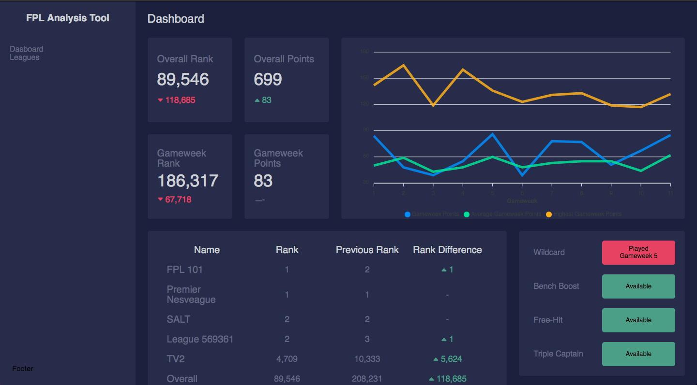

# fpl-analysis-tool

[](https://www.repostatus.org/#active)

Web application made with Vue. The app let's the user view and analyze organized statistics relevant to the game. The official Fantasy Premier League API is being used to retrieve general and user-specific data. The user will only need their [Fantasy Premier League team ID](https://www.fftitan.com/2020/08/how-to-find-my-fpl-team-id-with-screenshots/) to log in. 

## Project setup
```
npm install
```

### Compiles and hot-reloads for development
```
npm run serve
```

### Compiles and minifies for production
```
npm run build
```

### Lints and fixes files
```
npm run lint
```

## Visuals



## Project Status

Still in early development. Log-in functionality and leagues page are currently being developed. General data such as fixtures, player- and team statistics, and possibly transfer recommendation functionality are some of the things still remaining.
